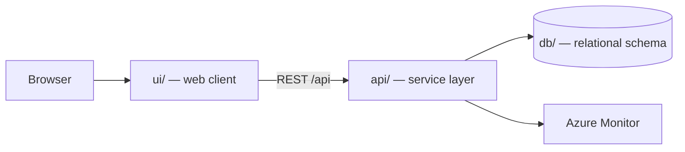

# Tutorial SemiScale Alpha (or SiliconStat)

A high-density, single-page financial analytics dashboard built to monitor the world’s top 10 semiconductor manufacturers by market capitalization. The core feature is an interactive, reactive chart and data matrix allowing users to toggle time-series performance filters seamlessly across 8 distinct intervals.

> Generated by the **Agentic SDLC / Software Factory**. Every change reaches this
> repository through an approved human gate — no agent merges its own work.

## Table of contents

1. [Overview](#overview)
2. [Architecture](#architecture)
3. [API surface](#api-surface)
4. [Screens](#screens)
5. [Folder structure](#folder-structure)
6. [Getting started](#getting-started)
7. [Build and test](#build-and-test)
8. [Deployment](#deployment)
9. [Published links](#published-links)
10. [Requirements scope](#requirements-scope)
11. [Intake documents](#intake-documents)
12. [Licence](#licence)

## Overview

| Item | Value |
| --- | --- |
| Project | Tutorial SemiScale Alpha (or SiliconStat) |
| Business owner | myaacoub@microsoft.com |
| IT owner | myaacoub@microsoft.com |
| Target environment | Dev |
| Work items | Tutorial SemiScale Alpha or SiliconStat |
| Source provider | GitHub |
| Repository | https://github.com/csdmichael/tutorial-semiscale-alpha-or-siliconstat |

## Architecture

Three tiers, deployed independently from this single repository:



- **ui/** renders the experience and never talks to the database directly.
- **api/** owns validation, authorization, and all data access.
- **db/** holds the schema and forward-only migrations; no ad-hoc changes.

## API surface

The service publishes an OpenAPI document, so the contract is browsable rather than
described in prose. Swagger UI is at `/docs`; the raw document is at `/openapi.json`.
The published URLs appear under [Published links](#published-links) once the pipeline runs.

| Method | Path | Purpose |
| --- | --- | --- |
| `GET` | `/health` | Liveness probe used by the deploy pipeline |
| `GET` | `/api/siliconstats` | List siliconstats, optionally filtered by `?status=` |
| `POST` | `/api/siliconstats` | Create a siliconstat |
| `GET` | `/api/siliconstats/{id}` | Fetch one siliconstat |
| `PATCH` | `/api/siliconstats/{id}` | Update title, reference, status, priority |
| `DELETE` | `/api/siliconstats/{id}` | Remove a siliconstat |

`db/migrations/0002_seed.sql` loads placeholder rows, and the service seeds the same rows,
so a fresh environment returns data on the first request. Replace them with real data.

## Screens

Taken from the approved UX mockups:

- **SiliconStats**
- **SiliconStat Detail**

## Folder structure

```
.
├── ui/                  Web client
│   ├── src/             Application source
│   └── package.json     Scripts and dependencies
├── api/                 Service layer (Python (FastAPI))
│   ├── app/             Routers, models, services
│   ├── tests/           Unit and integration tests
│   └── requirements.txt Runtime dependencies
├── db/                  Database
│   ├── migrations/      Forward-only, numbered migrations
│   └── schema.sql       Current consolidated schema
├── docs/                Project documentation
│   ├── architecture.md  Tiers, data flow, decisions
│   ├── api-contracts.md Endpoint contracts
│   ├── data-model.md    Tables and relationships
│   └── delivery-plan.md Sprints and milestones
├── .github/workflows/   CI and Azure deployment pipelines
├── LICENSE              MIT
└── README.md            This file
```

## Getting started

```bash
# API
cd api && python -m venv .venv && .venv/bin/pip install -r requirements.txt
.venv/bin/uvicorn app.main:app --reload --port 8000

# UI
cd ui && npm install && npm start        # http://localhost:4200

# Database
psql "$DATABASE_URL" -f db/schema.sql
```

## Build and test

| Command | Purpose |
| --- | --- |
| `cd api && python -m pytest -q` | API unit tests |
| `cd ui && npm test` | UI unit tests |
| `.github/workflows/ci.yml and .github/workflows/deploy-azure.yml` | Runs both through GitHub Actions |

## Deployment

`.github/workflows/deploy-azure.yml` publishes the API and UI to Azure App
Service using **OIDC federated credentials** — no stored passwords. The Software
Factory configures the repository's Azure identity secrets and App Service variables
after validating the exact ID-qualified GitHub environment subject.

## Published links

<!-- agentic-sdlc:published-links:start -->
_Populated automatically once the deployment pipeline succeeds._
<!-- agentic-sdlc:published-links:end -->

## Requirements scope

- Data ingestion and processing for top 10 semiconductor manufacturers (stubbed/mock data for Dev)
- Interactive chart and data matrix components with time-series filter toggling (UI/UX scaffolding)
- Responsive, accessible single-page layout (desktop/tablet)
- Unit tests for all core modules and UI state transitions
- `dataService.ts`: Loads manufacturer data (mocked for Dev), with error handling and refresh logic.
- `manufacturers.mock.json`: Contains sample data for the top 10 manufacturers.
- `useMarketData.ts`: React hook for fetching and updating market data, supports interval-based queries.
- `Chart.tsx`: Renders a multi-series time-series chart (using Chart.js or similar), supports zoom/pan/tooltips.
- Chart updates reactively to interval and manufacturer selection.
- `DataMatrix.tsx`: Tabular view of manufacturer performance, updates within 500ms of interval toggle.
- `TimeIntervalToggle.tsx`: UI for selecting among 8 intervals, with visual indication of selection.
- `useInterval.ts`: Hook for managing interval state and propagating changes.

## Intake documents

- `requirements` — [tutorial-semiscale-alpha-or-siliconstat-requirements.md](https://caldova37587778.sharepoint.com/sites/sdlc-tutorial-semiscale-alpha-or-siliconstat-5bbe3b7b/Shared%20Documents/SDLC%20Artifacts/Requirements/tutorial-semiscale-alpha-or-siliconstat-requirements.md)

## Licence

MIT — see [LICENSE](LICENSE).
